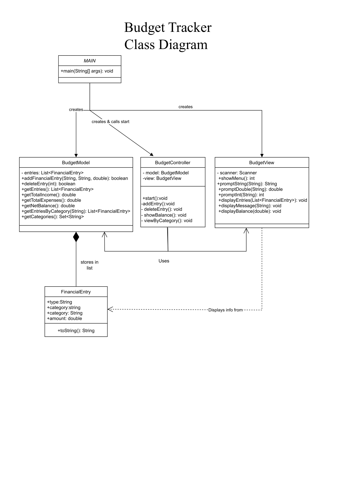
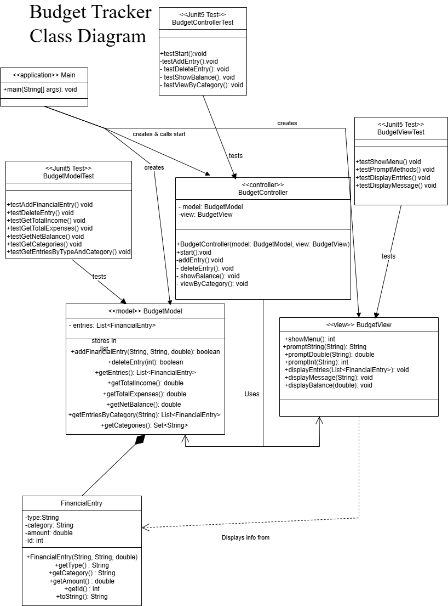
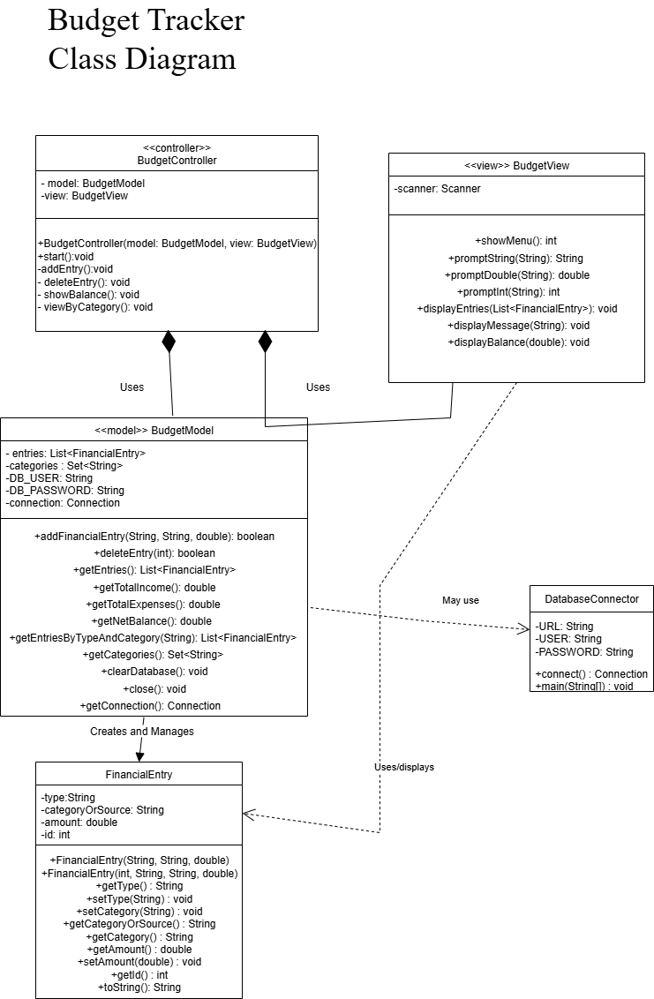

# ENSE 375 – Project Report

## Personal Budget Tracker

---

## Group Members

- **Tolani Oke-Steve** (200429404)
- **Dmytro Stepaniuk** (200426341)
- **Grant Zhao** (200484531)

---

## Table of Contents

1. [Introduction](#introduction)  
2. [Design Problem](#design-problem)  
   - [Problem Definition](#problem-definition)  
   - [Design Requirements](#design-requirements)  
     - [Functions](#functions)  
     - [Objectives](#objectives)  
     - [Constraints](#constraints)  
3. [Solution](#solution)  
   - [Solution 1](#solution-1)  
   - [Solution 2](#solution-2)  
   - [Final Solution](#final-solution)  
     - [Components](#components)  
     - [Environmental, Societal, Safety, and Economic Considerations](#environmental-societal-safety-and-economic-considerations)  
     - [Limitations](#limitations)  
4. [Team Work](#team-work)  
   - [Meeting 1](#meeting-1)  
   - [Meeting 2](#meeting-2)  
   - [Meeting 3](#meeting-3)  
   - [Meeting 4](#meeting-4)  
5. [Project Management](#project-management)  
6. [Conclusion and Future Work](#conclusion-and-future-work)  
7. [References](#references)  
8. [Appendix](#appendix)

---

## List of Figures
1. [Prototype 1] (#prototype1)
2.
3.

## List of Tables

1.
2.
3.
4.
5.

---

## Introduction
The Personal Budget Tracker is a software application made to support personal financial management. Its primary goal is to provide users with helpful and clear summaries of their income and spending. This information can be accessed easily, encouraging careful budgeting and financial decisions. This report presents a comprehensive overview of the design and development of Budget Tracker, outlining the planning going into the project, the implementation for that planning and the testing methods to evaluate the program.

---

## Design Problem

### Problem Definition

Managing personal finances effectively is a common challenge for many individuals, especially students and young professionals. Without clear insights into their income, expenses, and spending habits, people often struggle to make informed financial decisions. This can lead to overspending, missed savings opportunities, and financial stress.

The primary users of this application are individuals who want to track their personal budgets—particularly students, early-career professionals, and anyone aiming to improve their financial literacy and control. This tool is also designed for users with minimal financial background and limited time, who require a simple, reliable solution for budget management.

Solving this problem is significant because financial management is a core life skill that impacts mental health, stability, and future planning. By providing users with a clear and visual overview of their financial behavior, this application promotes responsible spending, savings habits, and ensures that users make better informed decisions about their finances.

Our proposed solution is a user-friendly software application that allows users to:

- Input monthly income and expenses  
- Categorize transactions  
- View visual summaries (e.g., pie charts, bar graphs)

The system emphasizes **simplicity**, **clarity**, and **accuracy**—making it a practical and empowering tool for everyday financial management.

---

### Design Requirements

#### Functions
The functions of the personal budget tracker include:
1. Track Spending: Enable users to input and visualize their weekly and monthly spending
2. Track Income:  Allow users to input and update their monthly income 
3. Set budget Goals: This budget tracker will give users the opportunity to set spending limits and saving goals on specific categories
4. Generate visual summaries: Create pie charts, bar graphs and other visualization tools to help users illustrate their financial health
5. Display budget Overview: Show users a clear overview of their financial behaviour.
6. Protect user information: Ensures users data are protected through encryption and authentication.
7. Categorize spending: Sort expenses and income into custom categories based on type.

#### Objectives
The objectives of the personal budget tracker include:
1. Secure: The application should protect user data and privacy through strong authentication
2. Reliable: The application should consistently perform accurate calculations and store user data securely
3. Efficient: With the personal budget tracker users should be able to manage their finances with minimal effort
4. Easy to use: The application should be intuitive and easy to use for users
5. Accurate: The application should ensure correct recording and analysis of spending and income
6. Responsive: Quick reaction to user inputs and updating visuals quickly are a priority for this application.
7. Flexible: This application should allow users to customize their financial goals to suit their specific needs.
8. Informative: This application should provide meaningful insights to users' financial behaviour.

#### Constraints
The following constraints ensure that the Personal Budget Tracker application meets user needs, remains within project scope, and complies with the ENSE 375 course requirements.

#### 1. Platform Compatibility
- The application must support common platforms including Windows, macOS, and modern web browsers.
- It must not require platform-specific installation or dependencies.

#### 2. User Accessibility
- The application must be usable by individuals with limited technical experience.
- The interface should be intuitive and user-friendly.

#### 3. Budget Limitations
- The project must avoid the use of paid software or subscription-based services.
- All tools, libraries, and frameworks must be free or open-source.

#### 4. Functional Scope
The application:
- Must support only core budgeting features:
  - Manual entry of income and expenses
  - Categorization of transactions
  - Basic data visualizations (e.g., pie charts, bar graphs)
- Must not include complex financial features such as:
  - Automatic bank syncing
  - Investment tracking
  - Predictive analytics

To meet ENSE 375 guidelines, the project must address the following design constraints:

#### 1. Economic Factors
- The solution must be cost-effective for end users, with no hidden costs.
- The software should assist users in managing finances without requiring premium features or external purchases.

#### 2. Reliability
- The application must ensure accurate calculations and stable performance.
- It will be tested using:
  - Unit testing
  - Boundary value testing
  - Equivalence class testing

#### 3. Ethics
- User data must be handled securely and respectfully.
- No sensitive data should be stored or shared beyond its intended use.

#### 4. Societal Impact
- The application promotes financial literacy and responsible spending.
- It supports individual financial well-being, contributing positively to broader societal stability.

---

## Solutions

### Solution 1
Prototype 1 – Core Budget Tracker (Minimal Viable Product)
Focus: Basic data handling and validation
 Model Responsibilities:
1. Add, edit, and delete income and expense entries
2. Categorize entries (e.g., Food, Rent, Transport, etc.)
3. Calculate total income, total expenses, and balance
4. Validate inputs (non-negative values, valid categories)

View Responsibilities (Console-based):
1. Simple CLI menus for adding/viewing income/expenses
2. Display balance summary
3. Show a list of transactions by category

Controller Responsibilities:
1. Receive user commands and delegate to model
2. Route model data back to the view

Testing Scope:
1. Unit testing for data validation and calculations
2. Boundary value and equivalence class testing on input fields

Not Chosen Because:
Solution 1 establishes a solid foundation for the budget tracker and captures essential business logic. However, its architecture focuses primarily on manual console interaction, which limits the scope of automated testing. With minor adjustments—like abstracting dependencies, refactoring the input loop, and encapsulating data—it could become significantly more testable without losing its core simplicity.
# Prototype 1

### Solution 2
Prototype 2 – Categorization & Basic Visualization

Adds: Data visualization and persistent storage

 Model Enhancements:
Store transaction data in a local file or simple DB (e.g., SQLite or CSV)
1. Summarize data by category (total per category)
2. Provide filtered lists (e.g., view all 'Food' expenses this month)

View Enhancements:
1. Display category-wise summaries
2. Basic pie chart (text or ASCII in CLI, or JavaFX/Swing if GUI is added)
3. Input prompts for filtering or summarizing

Controller Enhancements:
1. Handle data persistence (load/save)
2. Pass filtered requests and summaries from model to view

Testing Scope:
1. Integration testing of input/output flow
2. Path testing and use case testing (e.g., adding and viewing categorized expenses)

Not Chosen Because:
Solution 2 had issues with input validation, allowing illogical inputs in edge cases. Model and view were still tightly coupled, as well as reliance on public field access. The test methods also rely on console I/O which can be difficult to handle without advanced control. The tests also revealed that the scalability of the program is less than expected.

Suggestions:
+ MVC seperation of concerns
  - Model handles all financial logic.
  - View: Handles all user I/O operations without business logic
  - Controller: Mediates model and view and coordinates interactions.
+ Use strong typing for financial entries (ex: enum).
+ Encapsulate and use getters.
+ Improve input Validation and logic.

# Prototype 2

### Final Solution
Final Solution - 
The final solution provides a improved and more testable MVC architecture using Java and MySQL as the backend database (via JDBC).
+ Testing improvements
  - Replaces hard-coded duplicated DB connections in earlier prototypes.
  
Why this was chosen: 
 - Better testability, error catching and troubleshooting.
 - Much more scalable and maintainable than the prototypes.
 - Database logic is cleanly separated.
 - Can consistently access database without repeating boilerplate.

#### Components
| Component           | Role / Responsibility                       | Testing Methodology              |
| ------------------- | ------------------------------------------- | -------------------------------- |
| BudgetModel         | Business logic + data management            | JUnit unit testing (mock DB)     |
| FinancialEntry      | Represents a single income/expense record   | JUnit (object property tests)    |
| BudgetView          | Command-line interaction with user          | Manual input tests               |
| BudgetController    | Orchestrates interaction between view/model | Integration + flow control tests |
| DatabaseConnector   | Manages MySQL connection                    | Connection test + integration    |
| MySQL Database      | Stores all financial entries persistently   | Manual DB verification           |

#### Environmental, Societal, Safety, and Economic Considerations
Environmental:
 - Application does not use paper, since it is digital.
Societal:
 - Allows clients to make informed decisions based on their financial information.
 - Can be used by grassroots groups as a free financial tracker.
Economic:
 - Avoids third-party paid services and premium rescources.
 - Made with free open-source tools like Java, MySQL.
 - Made to run on low-end computer and laptops.
Safety:
 - exception handling ensures safeguarding of information.
 - JDBC has atomic operations for reliable data persistence.

#### Limitations
 - No GUI Interface, allowing for only command-line interface only and may seem unintuitive to some.
 - No data export
 - No authentication or login, meaning all data is public access.
 - User must type categories manually

---

## Team Work

### Meeting 1

**Time:** May 11, 2025, 12:20pm - 12:50pm
**Agenda:** Decide on the project idea

| Team Member      | Previous Task | Completion State | Next Task |
|------------------|---------------|------------------|-----------|
| Tolani    | Prepare project ideas           | Completed              | Write Problem Definition    |
| Dmytro    | Prepare project ideas           | Completed              | Setup Github    |
| Grant     | Prepare project ideas           | Completed              | Write Introduction    |

### Meeting 2

**Time:** May 21, 2025, 12:20pm - 12:50pm  
**Agenda:** Complete the Design Requirements part of the report

| Team Member      | Previous Task | Completion State | Next Task     |
|------------------|---------------|------------------|---------------|
| Tolani    | Write Problem Definition        | Completed              | Write Functional and Non-functional requirements|
| Dmytro    | Setup Github       | Completed              | Write Constraints for the project        |
| Grant    | Write Introduction        | Completed             | Write Objectives for the project        |

### Meeting 3
**Time:** Month Date, Year, Start–End  
**Agenda:** Review of Individual Progress

| Team Member      | Previous Task | Completion State | Next Task     |
|------------------|---------------|------------------|---------------|
| Team member 1    | Task 1        | 80%              | Task 1, Task 5|
| Team member 2    | Task 2        | 50%              | Task 2        |
| Team member 3    | Task 3        | 100%             | Task 6        |

### Meeting 4
**Time:** Month Date, Year, Start–End  
**Agenda:** Review of Individual Progress

| Team Member      | Previous Task | Completion State | Next Task     |
|------------------|---------------|------------------|---------------|
| Team member 1    | Task 1        | 80%              | Task 1, Task 5|
| Team member 2    | Task 2        | 50%              | Task 2        |
| Team member 3    | Task 3        | 100%             | Task 6        |

---

## Project Management

---

## Conclusion and Future Work

---

## References

---

## Appendix

---
